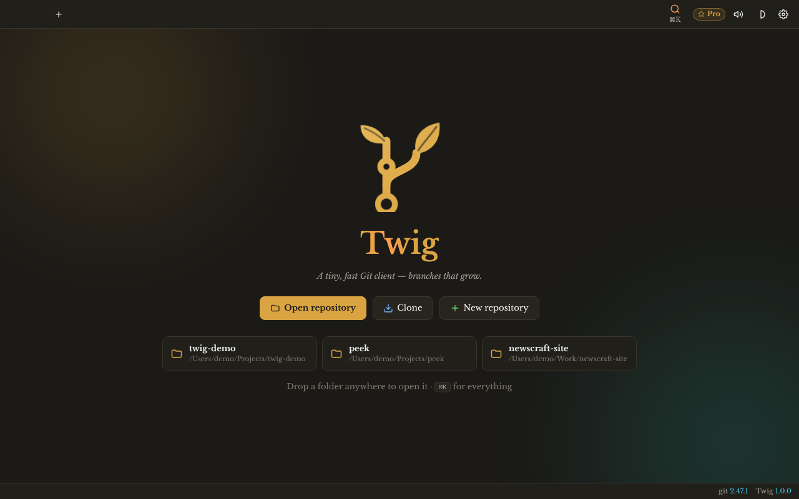
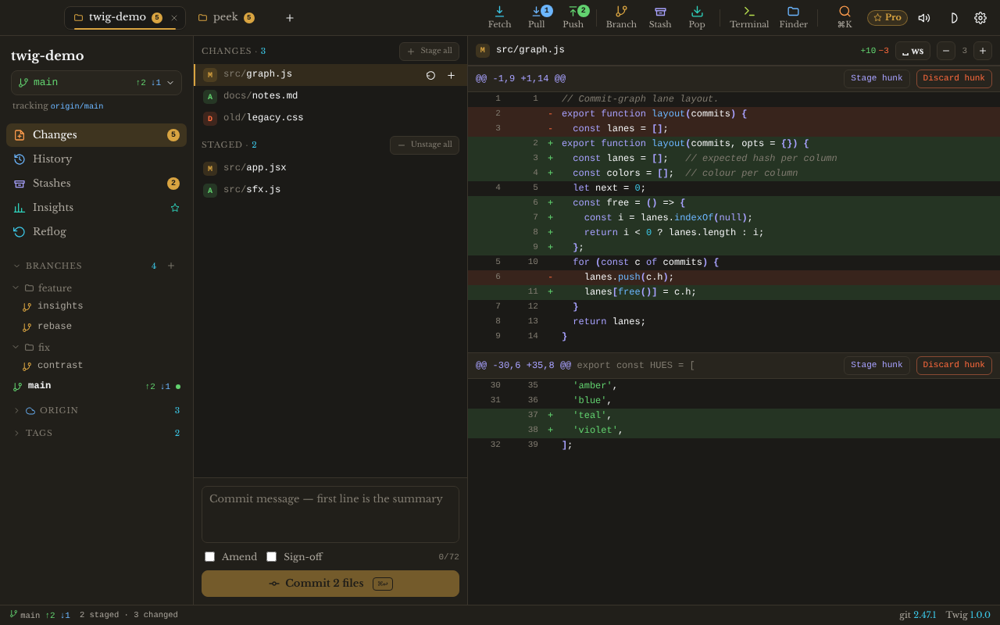
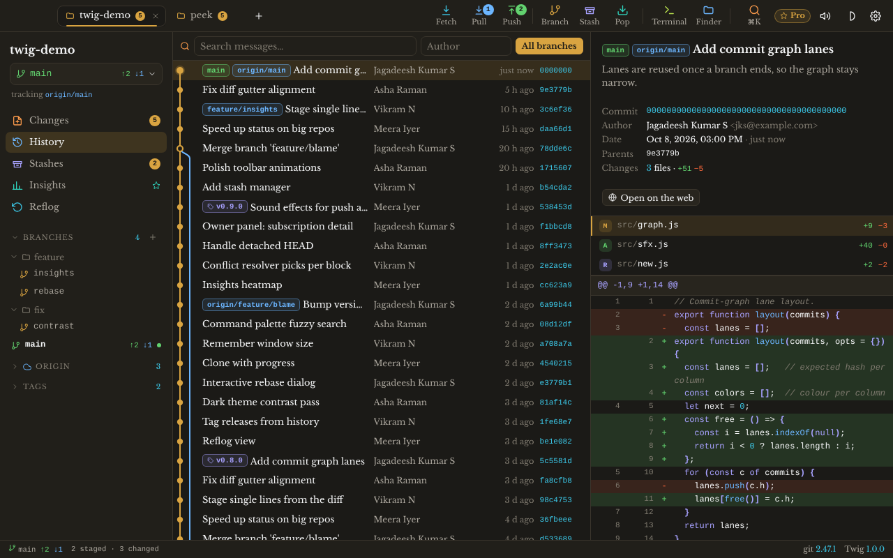
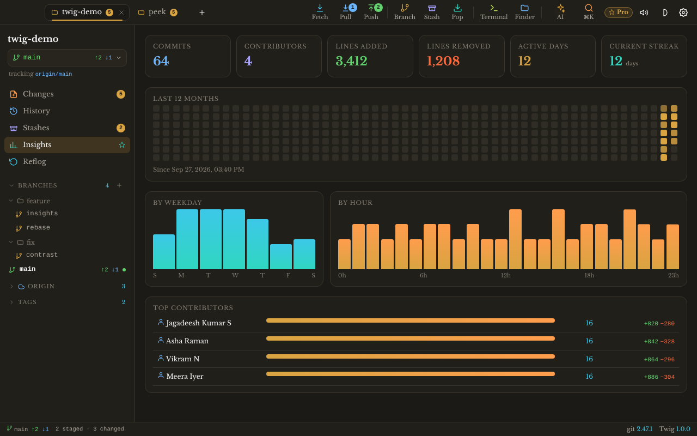
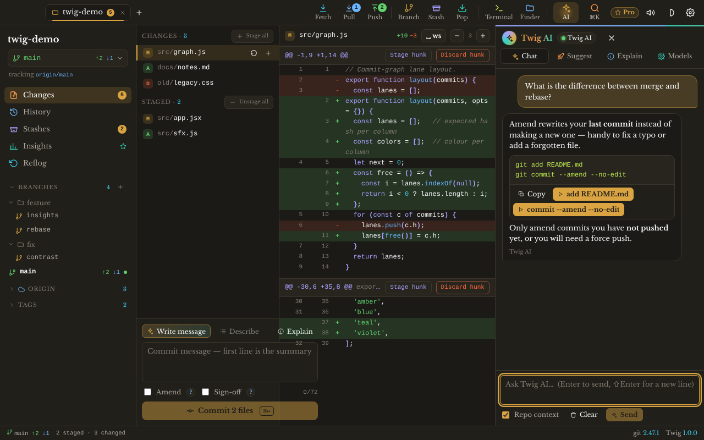
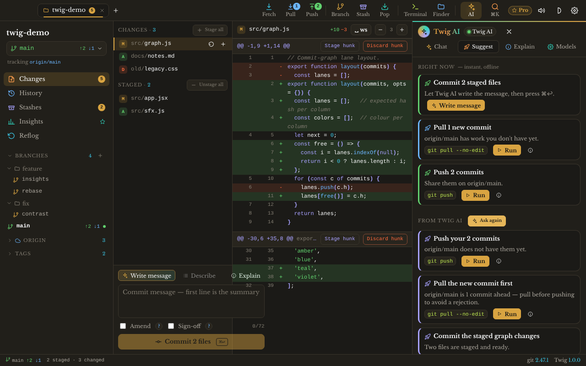
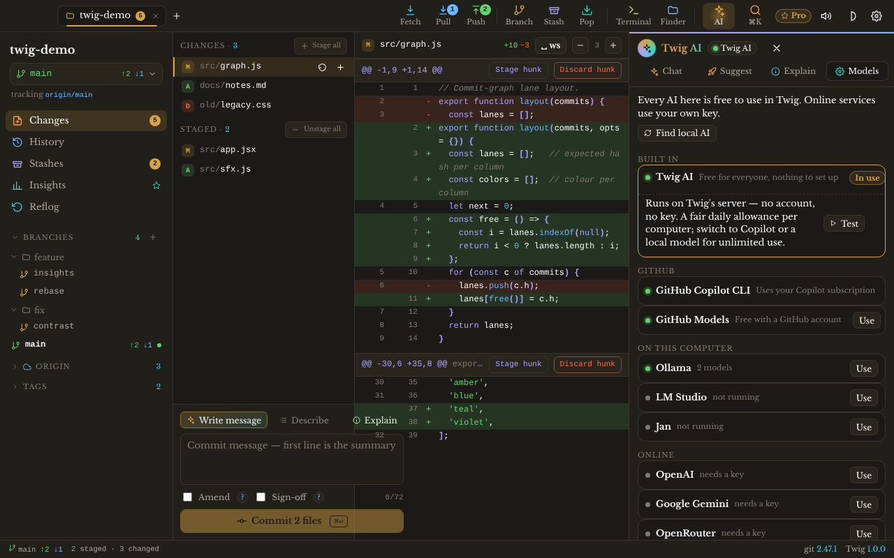
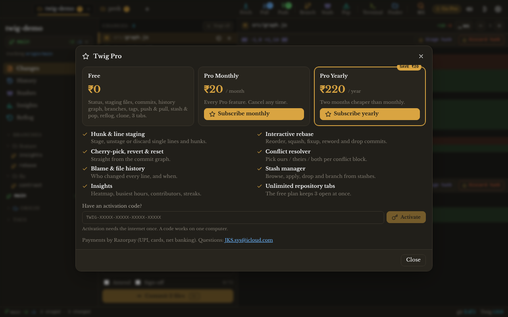

<p align="center">
  <picture>
    <source media="(prefers-color-scheme: dark)" srcset="icon-512.png">
    <source media="(prefers-color-scheme: light)" srcset="icon-512-light.png">
    
  </picture>
</p>

<h1 align="center">Twig</h1>

<p align="center"><b>Twig — AI Git client for macOS, Windows, Linux, ChromeOS and FreeBSD</b></p>

<p align="center">
  Version <b>1.0.1</b> · released 08 Oct 2026 ·
  <a href="https://github.com/JKS-sys/twig-08-oct-2026-releases/releases/latest">Download</a> ·
  <a href="https://ipconfig.co.network/twig">Website</a> ·
  <a href="RELEASE-NOTES.md">Release notes</a>
</p>

<p align="center">
  &nbsp;&nbsp;
  
</p>

Twig is an AI Git client — a native desktop app of a few megabytes. It runs the real `git` you already
have, so everything it does is ordinary Git — nothing to migrate, nothing hidden.

## AI

- **Twig AI, built in and free for everyone** — no account, no key, nothing to set up
- **GitHub Copilot CLI and GitHub Models** — use the AI you already have with GitHub
- **Every local AI** — Ollama, LM Studio, llama.cpp, Jan, GPT4All, LocalAI, vLLM, KoboldCpp,
  text-generation-webui and llamafile, all on your own machine
- **Online AI services** — any provider, by URL and API key
- **Writes commit messages and descriptions** from your staged changes
- **Explains every git command** Twig runs, in plain words
- **A chat box and a suggestion box** — ask about your repository, or take the next step it suggests

## Features

- **Commit graph** — branches and merges drawn as lanes, with search by message and author
- **Hunk & line staging** — stage or discard a whole file, one hunk, or single lines
- **Branches, tags and remotes** — create, rename, check out, delete, fetch, pull, push
- **Stash manager** — save, apply, pop, preview and drop stashes
- **Interactive rebase** — reorder, squash, fixup, reword and drop commits
- **Cherry-pick, revert and reset** — soft, mixed or hard, from any commit in the graph
- **Blame & file history** — who changed each line, and every version of a file
- **Conflict resolver** — ours / theirs / both per conflict, then mark resolved
- **Insights** — a contribution heatmap and per-author activity
- **Clone and init** — start from a URL or an empty folder
- **Multi-repo tabs** — keep several repositories open side by side
- **Command palette** — every action from the keyboard
- **Synthesized sound effects** — tiny Web Audio cues, one toggle to mute
- **Animations** — short, calm motion that respects “reduce motion”
- **Light and dark themes** — follows the system or your choice

## Screenshots

| | |
|---|---|
|  <br> *Welcome — open, clone or init a repository* |  <br> *Changes — stage hunks or single lines* |
|  <br> *History — the commit graph with branches and tags* |  <br> *Insights — activity heatmap and authors* |
|  <br> *Twig AI — chat with runnable commands* |  <br> *Suggestions — what to do next, one click to run* |
|  <br> *Choose the AI — Twig AI, Copilot, local and online models* |  <br> *The startup show* |
|  <br> *Twig Pro — plans and activation* | |

## Install

**macOS** (Apple silicon and Intel) — Terminal:

```bash
curl -fsSL https://ipconfig.co.network/updates/twig/install.sh | bash
```

The installer picks the right build, copies **Twig.app** to `/Applications` and clears the quarantine flag.
If you install from the DMG by hand instead, run this once before the first launch:

```bash
xattr -cr /Applications/Twig.app
```

**Windows** — PowerShell:

```powershell
irm https://ipconfig.co.network/updates/twig/install.ps1 | iex
```

SmartScreen may warn on first launch: *More info → Run anyway*.

The same command installs the **ARM64** build on Windows on Arm (Snapdragon / Surface Pro X and similar) —
or download `Twig_1.0.1_arm64-setup.exe` from the [latest release](https://github.com/JKS-sys/twig-08-oct-2026-releases/releases/latest).

**Linux** (x86_64)

- AppImage: `curl -fsSL https://ipconfig.co.network/updates/twig/install.sh | bash` — installs to `~/.local/bin/twig`.
  Or download `Twig_1.0.1_amd64.AppImage` from the [latest release](https://github.com/JKS-sys/twig-08-oct-2026-releases/releases/latest),
  then `chmod +x Twig_*.AppImage && ./Twig_*.AppImage` (needs `libfuse2`).
- Debian / Ubuntu: `curl -fsSL https://ipconfig.co.network/updates/twig/install.sh | bash -s -- --deb`,
  or download `Twig_1.0.1_amd64.deb` and `sudo apt install ./Twig_1.0.1_amd64.deb`.

**Linux ARM64** (Raspberry Pi 4/5 with a 64-bit OS, ARM laptops and servers) — Debian / Ubuntu:

```bash
curl -fsSL https://ipconfig.co.network/updates/twig/install.sh | bash
```

or download `Twig_1.0.1_arm64.deb` and `sudo apt install ./Twig_1.0.1_arm64.deb`.
ARM64 Linux has a .deb only — there is no ARM AppImage.

**ChromeOS** — Twig runs in the Linux development environment (a Debian container), on Intel/AMD and ARM Chromebooks:

1. **Settings → Advanced → Developers → Linux development environment → Turn on** (a few minutes the first time).
2. Open the **Terminal** app and run the installer — it picks the right package for your Chromebook:
   ```bash
   curl -fsSL https://ipconfig.co.network/updates/twig/install.sh | bash
   ```
   Or by hand: `dpkg --print-architecture` says `amd64` (Intel/AMD) or `arm64` (ARM). Download
   `Twig_1.0.1_amd64.deb` or `Twig_1.0.1_arm64.deb`, move it to **Linux files**, then double-click it —
   or run `sudo apt install ./Twig_1.0.1_<arch>.deb`.
3. Install Git in the container: `sudo apt install git`.
4. Open Twig from the launcher (**Linux apps**). Your repositories live in **Linux files**; share other
   folders with Linux from the Files app (right-click → *Share with Linux*).

**FreeBSD** (amd64, FreeBSD 14 or later, with a desktop) — as root:

```sh
pkg install webkit2-gtk_41 git bash curl
curl -fsSL https://ipconfig.co.network/updates/twig/install.sh | bash
```

Or download `Twig_1.0.1_freebsd_amd64.tar.gz` and, in the download folder,
`tar -xzf Twig_1.0.1_freebsd_amd64.tar.gz && sudo sh install.sh` — it installs to `/usr/local/bin/twig`
with a menu entry and icon (`sh install.sh --uninstall` removes them).

**Haiku** — Haiku isn't supported: Twig's window engine (Tauri/WebKit) has no Haiku port.

**Homebrew** — Homebrew without a tap needs an Apple-notarized app; Twig is ad-hoc signed today, so use the curl installer.

Twig updates itself on macOS, Windows (x64 and ARM64) and Linux (AppImage and .deb, x86_64 and ARM64): when a new
version is out it offers to install it and restart. A .deb update asks for your password, like any package install.
On FreeBSD, run the installer again to update.

## Platforms

| System | CPU | Download | Updates itself |
|---|---|---|---|
| macOS 10.15+ | Apple silicon | `Twig_1.0.1_aarch64.dmg` | yes |
| macOS 10.15+ | Intel | `Twig_1.0.1_x64.dmg` | yes |
| Windows 10 / 11 | x64 | `Twig_1.0.1_x64-setup.exe` | yes |
| Windows 11 | ARM64 | `Twig_1.0.1_arm64-setup.exe` | yes |
| Linux | x86_64 | `Twig_1.0.1_amd64.AppImage` · `Twig_1.0.1_amd64.deb` | yes |
| Linux | ARM64 | `Twig_1.0.1_arm64.deb` | yes |
| ChromeOS (Linux development environment) | x86_64 / ARM64 | the Linux `.deb` for the Chromebook's CPU | yes |
| FreeBSD 14+ | amd64 | `Twig_1.0.1_freebsd_amd64.tar.gz` | no — rerun the installer |
| Haiku | — | not available | — |

Haiku isn't supported: Twig's window engine (Tauri/WebKit) has no Haiku port.

## Pricing

| Free | Pro monthly | Pro yearly |
|---|---|---|
| ₹0 | **₹20 / month** | **₹220 / year** |
| Download and use Twig for free | Renews every month, cancel any time | Renews every year — two months cheaper |

After paying you get an activation code at once; in Twig open **Activate Pro** and paste it.

[Get Twig Pro →](https://ipconfig.co.network/twig/buy?plan=monthly) · [yearly](https://ipconfig.co.network/twig/buy?plan=yearly)

## Links

- Releases and downloads: https://github.com/JKS-sys/twig-08-oct-2026-releases/releases
- Website: https://ipconfig.co.network/twig
- Release notes: [RELEASE-NOTES.md](RELEASE-NOTES.md)
- Update feed: [latest.json](latest.json)

## Creator

Made by Jagadeesh Kumar S, creator — [youtube.com/@JKS-sys](https://www.youtube.com/@JKS-sys)

## Licence

Proprietary. © 2026 Jagadeesh Kumar S. All rights reserved.
The installers are free to download and use; the source code is not published, and copying,
modifying or redistributing Twig is not permitted without written permission.
